```mermaid
erDiagram
    %% ===== CORE IDENTITY & ACCESS =====
    USERS {
        uuid id PK
        string email UK
        string password_hash "nullable if OAuth"
        string full_name
        string avatar_url
        enum auth_provider "LOCAL | GOOGLE | GITHUB"
        string oauth_id "nullable"
        boolean mfa_enabled
        string mfa_secret "nullable, encrypted"
        timestamp email_verified_at
        timestamp created_at
        timestamp last_login
    }

    WORKSPACES {
        uuid id PK
        string name
        string description
        string icon "emoji or URL"
        uuid owner_id FK
        enum template "CUSTOM | RESEARCH | COURSE | LEGAL | MEETING"
        boolean is_public
        jsonb settings "chunk_size, overlap, model preferences"
        timestamp created_at
        timestamp updated_at
    }

    WORKSPACE_MEMBERS {
        uuid id PK
        uuid workspace_id FK
        uuid user_id FK
        enum role "OWNER | EDITOR | VIEWER | COMMENTER"
        timestamp joined_at
    }

    API_KEYS {
        uuid id PK
        uuid user_id FK
        string key_hash UK "hashed, never stored raw"
        string name "My CLI Key"
        jsonb permissions "read, write, admin scopes"
        timestamp expires_at
        timestamp last_used_at
        timestamp created_at
    }

    %% ===== KNOWLEDGE BASE (MULTI-MODAL INGESTION) =====
    DOCUMENTS {
        uuid id PK
        uuid workspace_id FK
        uuid uploaded_by FK
        string title
        string original_filename
        string storage_url "S3 or MinIO URL"
        string mime_type
        bigint file_size_bytes
        enum source_type "PDF | MARKDOWN | TEXT | YOUTUBE | WEB_URL | AUDIO | IMAGE | CODE | CSV"
        enum status "QUEUED | PROCESSING | CHUNKING | EMBEDDING | INDEXED | FAILED"
        string error_message "nullable, if FAILED"
        int total_chunks
        int token_count
        jsonb metadata "author, tags, page_count, duration, language"
        tsvector search_vector "full-text search index"
        timestamp processed_at
        timestamp created_at
    }

    DOCUMENT_CHUNKS {
        uuid id PK
        uuid document_id FK
        text content "The actual text segment"
        vector embedding "dim 1536 OpenAI"
        int chunk_index "Order in original doc"
        int token_count
        string section_heading "nullable"
        jsonb location "page_num, start_time, end_time, line_range"
        tsvector search_vector "BM25 full-text index"
        timestamp created_at
    }

    %% ===== KNOWLEDGE GRAPH =====
    KG_ENTITIES {
        uuid id PK
        uuid workspace_id FK
        string name "Einstein, Photosynthesis, BRCA1"
        enum entity_type "PERSON | ORG | CONCEPT | DATE | LOCATION | EVENT | TERM"
        text description "Short LLM-generated description"
        int mention_count "How many chunks reference this"
        jsonb metadata "aliases, links"
        timestamp created_at
    }

    KG_EDGES {
        uuid id PK
        uuid source_entity_id FK
        uuid target_entity_id FK
        string relationship "developed, published_in, causes, part_of"
        float confidence "0.0 to 1.0"
        uuid source_chunk_id FK "Which chunk this was extracted from"
        timestamp created_at
    }

    KG_ENTITY_CHUNKS {
        uuid entity_id FK
        uuid chunk_id FK
        int mention_offset "Character offset in chunk"
    }

    %% ===== CONVERSATIONAL AI (AGENTIC RAG) =====
    CHAT_SESSIONS {
        uuid id PK
        uuid workspace_id FK
        uuid user_id FK
        string title
        uuid parent_session_id FK "nullable, for conversation branching"
        int branch_point_message_id "nullable"
        boolean is_pinned
        timestamp last_active_at
        timestamp created_at
    }

    MESSAGES {
        uuid id PK
        uuid session_id FK
        enum role "USER | ASSISTANT | SYSTEM | TOOL"
        text content
        jsonb citations "Array of chunk_id and score and location"
        jsonb tool_calls "Array of tool_name and input and output for agentic RAG"
        jsonb suggested_followups "Array of 3 suggested questions"
        int token_usage
        float confidence_score "0.0 to 1.0 self-evaluated"
        boolean is_bookmarked
        timestamp created_at
    }

    MESSAGE_FEEDBACK {
        uuid id PK
        uuid message_id FK
        uuid user_id FK
        enum rating "GOOD | BAD | PARTIAL"
        text comment "Optional user feedback"
        timestamp created_at
    }

    %% ===== ARTIFACTS (AUTO-GENERATED) =====
    ARTIFACTS {
        uuid id PK
        uuid workspace_id FK
        uuid generated_by FK "user who triggered it"
        uuid source_session_id FK "nullable, chat that triggered it"
        enum artifact_type "SUMMARY | FLASHCARD_SET | MIND_MAP | TIMELINE | STUDY_GUIDE | COMPARISON | GLOSSARY"
        string title
        jsonb content "The artifact data as structured JSON"
        string export_url "nullable, S3 link to exported file"
        timestamp created_at
    }

    %% ===== COLLABORATION =====
    ANNOTATIONS {
        uuid id PK
        uuid workspace_id FK
        uuid user_id FK
        uuid target_chunk_id FK "nullable"
        uuid target_message_id FK "nullable"
        text content "The annotation text"
        jsonb highlight_range "start_offset, end_offset"
        timestamp created_at
    }

    ACTIVITY_LOG {
        uuid id PK
        uuid workspace_id FK
        uuid user_id FK
        enum action "UPLOAD | DELETE | SHARE | QUERY | ANNOTATE | EXPORT | SETTINGS_CHANGE"
        string description "John uploaded Lecture3.pdf"
        jsonb details "extra context"
        timestamp created_at
    }

    %% ===== OBSERVABILITY =====
    AUDIT_LOG {
        uuid id PK
        uuid user_id FK
        string ip_address
        string user_agent
        enum action "LOGIN | LOGOUT | API_CALL | DATA_EXPORT | DATA_DELETE | PERMISSION_CHANGE"
        jsonb details
        timestamp created_at
    }

    USAGE_METRICS {
        uuid id PK
        uuid user_id FK
        uuid workspace_id FK "nullable"
        date metric_date
        int queries_count
        int documents_processed
        int tokens_consumed_embedding
        int tokens_consumed_chat
        float estimated_cost_usd
    }

    %% ===== WEBHOOKS =====
    WEBHOOKS {
        uuid id PK
        uuid user_id FK
        uuid workspace_id FK "nullable, workspace-scoped or global"
        string url "target URL"
        enum event "DOCUMENT_INDEXED | DOCUMENT_FAILED | CHAT_COMPLETED"
        string secret "HMAC signing secret"
        boolean is_active
        timestamp last_triggered_at
        timestamp created_at
    }

    %% ===== RELATIONSHIPS =====

    %% Identity and Access
    USERS ||--o{ WORKSPACES : "owns"
    USERS ||--o{ WORKSPACE_MEMBERS : "member of"
    WORKSPACES ||--o{ WORKSPACE_MEMBERS : "has members"
    USERS ||--o{ API_KEYS : "has keys"

    %% Knowledge Base
    WORKSPACES ||--o{ DOCUMENTS : "contains"
    USERS ||--o{ DOCUMENTS : "uploads"
    DOCUMENTS ||--o{ DOCUMENT_CHUNKS : "split into"

    %% Knowledge Graph
    WORKSPACES ||--o{ KG_ENTITIES : "has entities"
    KG_ENTITIES ||--o{ KG_EDGES : "source of"
    KG_ENTITIES ||--o{ KG_EDGES : "target of"
    KG_ENTITIES ||--o{ KG_ENTITY_CHUNKS : "mentioned in"
    DOCUMENT_CHUNKS ||--o{ KG_ENTITY_CHUNKS : "contains mention"
    DOCUMENT_CHUNKS ||--o{ KG_EDGES : "extracted from"

    %% Chat
    USERS ||--o{ CHAT_SESSIONS : "starts"
    WORKSPACES ||--o{ CHAT_SESSIONS : "context for"
    CHAT_SESSIONS ||--o{ MESSAGES : "history"
    CHAT_SESSIONS ||--o{ CHAT_SESSIONS : "branched from"
    MESSAGES ||--o{ MESSAGE_FEEDBACK : "rated by"
    USERS ||--o{ MESSAGE_FEEDBACK : "gives feedback"

    %% Artifacts
    WORKSPACES ||--o{ ARTIFACTS : "has artifacts"
    USERS ||--o{ ARTIFACTS : "generates"
    CHAT_SESSIONS ||--o{ ARTIFACTS : "triggered from"

    %% Collaboration
    WORKSPACES ||--o{ ANNOTATIONS : "has annotations"
    USERS ||--o{ ANNOTATIONS : "writes"
    WORKSPACES ||--o{ ACTIVITY_LOG : "tracks activity"

    %% Observability
    USERS ||--o{ AUDIT_LOG : "audited"
    USERS ||--o{ USAGE_METRICS : "tracked"
    WORKSPACES ||--o{ USAGE_METRICS : "tracked per"
    USERS ||--o{ WEBHOOKS : "configures"
    WORKSPACES ||--o{ WEBHOOKS : "scoped to"
```

# ER Diagram — OmniScript (Personal Knowledge OS)

## Overview

This Entity-Relationship diagram defines the **complete database schema** for OmniScript — a full-stack Agentic RAG platform with knowledge graph, collaboration, multi-modal ingestion, and observability.

The schema supports the **full AI Knowledge Lifecycle**:
1. **Identity & Access** — Users, workspaces, roles, API keys
2. **Ingestion** — Multi-modal document upload with async processing
3. **Processing** — Chunking, embedding, entity extraction
4. **Knowledge Graph** — Auto-discovered entities and relationships
5. **Retrieval** — Hybrid search (vector + full-text)
6. **Generation** — Agentic RAG with tool use and multi-step reasoning
7. **Collaboration** — Shared workspaces, annotations, activity feed
8. **Observability** — Audit logs, usage metrics, feedback loops

---

---

## Key Indexes

| Table | Index | Purpose |
|---|---|---|
| `DOCUMENT_CHUNKS` | **HNSW** on `embedding` | Millisecond vector similarity search |
| `DOCUMENT_CHUNKS` | **GIN** on `search_vector` | BM25-style full-text search |
| `DOCUMENTS` | **GIN** on `search_vector` | Document-level full-text search |
| `DOCUMENTS` | `(workspace_id, status)` | Find processing/stuck documents |
| `MESSAGES` | `(session_id, created_at)` | Load chat history chronologically |
| `CHAT_SESSIONS` | `(user_id, last_active_at DESC)` | "Recent Chats" sidebar |
| `DOCUMENT_CHUNKS` | `(document_id)` | Cascade delete chunks when doc deleted |
| `KG_ENTITIES` | `(workspace_id, entity_type)` | Filter graph by entity type |
| `KG_EDGES` | `(source_entity_id)`, `(target_entity_id)` | Graph traversal |
| `KG_ENTITY_CHUNKS` | `(entity_id)`, `(chunk_id)` | Entity-Chunk lookups |
| `ACTIVITY_LOG` | `(workspace_id, created_at DESC)` | Activity feed pagination |
| `AUDIT_LOG` | `(user_id, created_at DESC)` | Security audit trail |
| `USAGE_METRICS` | `(user_id, metric_date)` | Daily usage aggregation |
| `API_KEYS` | `(key_hash)` | Fast API key lookup on every request |
| `MESSAGE_FEEDBACK` | `(message_id)` | Aggregate feedback per message |

---

## Architecture Decisions

### 1. Hybrid Search (Vector + Full-Text in Postgres)
- **What:** Both `DOCUMENT_CHUNKS` and `DOCUMENTS` have `tsvector` columns alongside `vector` embeddings.
- **Why:** Vector search finds semantic matches ("puppy" finds "dog"), but misses exact terms ("BRCA1"). Full-text search catches exact matches. Reciprocal Rank Fusion (RRF) merges both.
- **Benefit:** Google-grade retrieval quality in a single database — no external search engine needed.

### 2. Knowledge Graph in Postgres (Not Neo4j)
- **What:** `KG_ENTITIES`, `KG_EDGES`, and `KG_ENTITY_CHUNKS` tables with standard foreign keys.
- **Why:** The graph is workspace-scoped and moderate-sized (thousands of nodes, not billions). Postgres handles this with recursive CTEs and proper indexing. Adding Neo4j would mean another database to manage.
- **Benefit:** Single database simplicity. Can always migrate to Neo4j later if graph queries become the bottleneck.

### 3. Agentic RAG via Tool Calls (MESSAGES table)
- **What:** Messages have a `tool_calls` JSONB column that stores the agent's reasoning steps.
- **Why:** The agent may perform multiple searches, rephrase queries, or call different tools. Storing this creates a debuggable, replayable audit trail of how answers were generated.
- **Benefit:** Full transparency into AI reasoning. Enables quality analysis ("which tool paths produce the best answers?").

### 4. Conversation Branching (Self-Referential CHAT_SESSIONS)
- **What:** `CHAT_SESSIONS` has a `parent_session_id` FK pointing to itself.
- **Why:** Users may want to explore "what if" tangents without losing their original conversation.
- **Benefit:** Tree-structured conversations, like Git branches for thought.

### 5. Feedback Loop (MESSAGE_FEEDBACK)
- **What:** Users rate AI answers as GOOD / BAD / PARTIAL.
- **Why:** Creates a labeled dataset for evaluating and improving RAG quality over time.
- **Benefit:** Enables RLHF-style fine-tuning signals and automated quality dashboards.

### 6. Webhook and API Key System
- **What:** `WEBHOOKS` for push notifications, `API_KEYS` for programmatic access.
- **Why:** Makes OmniScript a **platform**, not just an app. External tools can integrate.
- **Benefit:** Slack bots, CI/CD pipelines, Chrome extensions can all interact with OmniScript.

### 7. Multi-Granularity Observability
- **What:** Three separate tables: `ACTIVITY_LOG` (workspace-level), `AUDIT_LOG` (security), `USAGE_METRICS` (billing).
- **Why:** Each serves a different audience: workspace members, security admins, and billing systems.
- **Benefit:** Clean separation of concerns. Activity feed is not the same as security audit is not the same as cost tracking.
