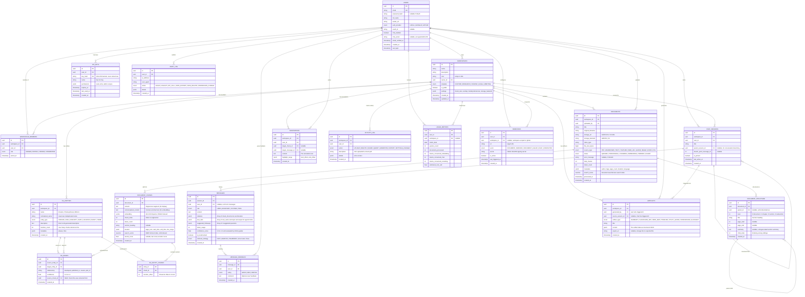

# ER Diagram — OmniScript

## Overview

Complete database schema for OmniScript — 18 tables covering identity, ingestion, document structure (PageIndex), knowledge graph, agentic RAG, collaboration, and observability.

---

```mermaid
erDiagram
    %% ===== CORE IDENTITY & ACCESS =====
    USERS {
        uuid id PK
        string email UK
        string password_hash "nullable if OAuth"
        string full_name
        string avatar_url
        enum auth_provider "LOCAL | GOOGLE | GITHUB"
        string oauth_id "nullable"
        boolean mfa_enabled
        string mfa_secret "nullable, encrypted AES-256"
        timestamp email_verified_at
        timestamp created_at
        timestamp last_login
    }

    WORKSPACES {
        uuid id PK
        string name
        string description
        string icon "emoji or URL"
        uuid owner_id FK
        enum template "CUSTOM | RESEARCH | COURSE | LEGAL | MEETING"
        boolean is_public
        jsonb settings "chunk_size, overlap, model preferences, storage_backend"
        timestamp created_at
        timestamp updated_at
    }

    WORKSPACE_MEMBERS {
        uuid id PK
        uuid workspace_id FK
        uuid user_id FK
        enum role "OWNER | EDITOR | VIEWER | COMMENTER"
        timestamp joined_at
    }

    API_KEYS {
        uuid id PK
        uuid user_id FK
        string key_hash UK "SHA-256 hashed, never stored raw"
        string name "My CLI Key"
        jsonb permissions "read, write, admin scopes"
        timestamp expires_at
        timestamp last_used_at
        timestamp created_at
    }

    %% ===== KNOWLEDGE BASE (MULTI-MODAL INGESTION) =====
    DOCUMENTS {
        uuid id PK
        uuid workspace_id FK
        uuid uploaded_by FK
        string title
        string original_filename
        string storage_url "GridFS ID or S3 URL"
        string storage_backend "GRIDFS | S3"
        string mime_type
        bigint file_size_bytes
        enum source_type "PDF | MARKDOWN | TEXT | YOUTUBE | WEB_URL | AUDIO | IMAGE | CODE | CSV"
        enum status "QUEUED | PROCESSING | CHUNKING | EMBEDDING | INDEXED | FAILED"
        string error_message "nullable, if FAILED"
        int total_chunks
        int token_count
        jsonb metadata "author, tags, page_count, duration, language"
        tsvector search_vector "document-level full-text search index"
        timestamp processed_at
        timestamp created_at
    }

    DOCUMENT_CHUNKS {
        uuid id PK
        uuid document_id FK
        text content "Original text segment (for display)"
        text contextualized_content "Context-enriched text (for embedding)"
        vector embedding "dim 1536 OpenAI, HNSW indexed"
        int chunk_index "Order in original doc"
        int token_count
        string section_heading "nullable"
        jsonb location "page_num, start_time, end_time, line_range"
        tsvector search_vector "BM25 full-text index, GIN indexed"
        float rerank_score "nullable, last cross-encoder score"
        timestamp created_at
    }

    %% ===== DOCUMENT STRUCTURE (PAGEINDEX) =====
    DOCUMENT_STRUCTURE {
        uuid id PK
        uuid document_id FK
        uuid parent_id FK "nullable, self-referential tree"
        int level "0=document, 1=chapter, 2=section, 3=subsection"
        string title "Section heading"
        int page_start "nullable"
        int page_end "nullable"
        text summary "nullable, LLM-generated section summary"
        int child_order "Ordering among siblings"
        timestamp created_at
    }

    %% ===== KNOWLEDGE GRAPH =====
    KG_ENTITIES {
        uuid id PK
        uuid workspace_id FK
        string name "Einstein, Photosynthesis, BRCA1"
        string normalized_name "lowercase deduplicated name"
        enum entity_type "PERSON | ORG | CONCEPT | DATE | LOCATION | EVENT | TERM"
        text description "Short LLM-generated description"
        int mention_count "How many chunks reference this"
        jsonb metadata "aliases, links"
        timestamp created_at
    }

    KG_EDGES {
        uuid id PK
        uuid source_entity_id FK
        uuid target_entity_id FK
        string relationship "developed, published_in, causes, part_of"
        float confidence "0.0 to 1.0"
        uuid source_chunk_id FK "Which chunk this was extracted from"
        timestamp created_at
    }

    KG_ENTITY_CHUNKS {
        uuid entity_id FK
        uuid chunk_id FK
        int mention_offset "Character offset in chunk"
    }

    %% ===== CONVERSATIONAL AI (AGENTIC RAG) =====
    CHAT_SESSIONS {
        uuid id PK
        uuid workspace_id FK
        uuid user_id FK
        string title
        uuid parent_session_id FK "nullable, for conversation branching"
        int branch_point_message_id "nullable"
        boolean is_pinned
        timestamp last_active_at
        timestamp created_at
    }

    MESSAGES {
        uuid id PK
        uuid session_id FK
        uuid user_id FK "nullable, null for AI messages"
        enum role "USER | ASSISTANT | SYSTEM | TOOL"
        text content
        jsonb citations "Array of chunk_id and score and location"
        jsonb tool_calls "Array of tool_name and input and output for agentic RAG"
        jsonb suggested_followups "Array of 3 suggested questions"
        int token_usage
        float confidence_score "0.0 to 1.0 self-evaluated by CRAG grader"
        boolean is_bookmarked
        enum retrieval_strategy "FAST | AGENTIC | PAGEINDEX, what router chose"
        timestamp created_at
    }

    MESSAGE_FEEDBACK {
        uuid id PK
        uuid message_id FK
        uuid user_id FK
        enum rating "GOOD | BAD | PARTIAL"
        text comment "Optional user feedback"
        timestamp created_at
    }

    %% ===== ARTIFACTS (AUTO-GENERATED) =====
    ARTIFACTS {
        uuid id PK
        uuid workspace_id FK
        uuid generated_by FK "user who triggered it"
        uuid source_session_id FK "nullable, chat that triggered it"
        enum artifact_type "SUMMARY | FLASHCARD_SET | MIND_MAP | TIMELINE | STUDY_GUIDE | COMPARISON | GLOSSARY"
        string title
        jsonb content "The artifact data as structured JSON"
        string export_url "nullable, storage link to exported file"
        timestamp created_at
    }

    %% ===== COLLABORATION =====
    ANNOTATIONS {
        uuid id PK
        uuid workspace_id FK
        uuid user_id FK
        uuid target_chunk_id FK "nullable"
        uuid target_message_id FK "nullable"
        text content "The annotation text"
        jsonb highlight_range "start_offset, end_offset"
        timestamp created_at
    }

    ACTIVITY_LOG {
        uuid id PK
        uuid workspace_id FK
        uuid user_id FK
        enum action "UPLOAD | DELETE | SHARE | QUERY | ANNOTATE | EXPORT | SETTINGS_CHANGE"
        string description "John uploaded Lecture3.pdf"
        jsonb details "extra context"
        timestamp created_at
    }

    %% ===== OBSERVABILITY =====
    AUDIT_LOG {
        uuid id PK
        uuid user_id FK
        string ip_address
        string user_agent
        enum action "LOGIN | LOGOUT | API_CALL | DATA_EXPORT | DATA_DELETE | PERMISSION_CHANGE"
        jsonb details
        timestamp created_at
    }

    USAGE_METRICS {
        uuid id PK
        uuid user_id FK
        uuid workspace_id FK "nullable"
        date metric_date
        int queries_count
        int documents_processed
        int tokens_consumed_embedding
        int tokens_consumed_chat
        int tokens_consumed_reranking
        float estimated_cost_usd
    }

    %% ===== WEBHOOKS =====
    WEBHOOKS {
        uuid id PK
        uuid user_id FK
        uuid workspace_id FK "nullable, workspace-scoped or global"
        string url "target URL"
        enum event "DOCUMENT_INDEXED | DOCUMENT_FAILED | CHAT_COMPLETED"
        string secret "HMAC-SHA256 signing secret"
        boolean is_active
        timestamp last_triggered_at
        timestamp created_at
    }

    %% ===== RELATIONSHIPS =====

    %% Identity and Access
    USERS ||--o{ WORKSPACES : "owns"
    USERS ||--o{ WORKSPACE_MEMBERS : "member of"
    WORKSPACES ||--o{ WORKSPACE_MEMBERS : "has members"
    USERS ||--o{ API_KEYS : "has keys"

    %% Knowledge Base
    WORKSPACES ||--o{ DOCUMENTS : "contains"
    USERS ||--o{ DOCUMENTS : "uploads"
    DOCUMENTS ||--o{ DOCUMENT_CHUNKS : "split into"
    DOCUMENTS ||--o{ DOCUMENT_STRUCTURE : "structured as"
    DOCUMENT_STRUCTURE ||--o{ DOCUMENT_STRUCTURE : "parent-child"

    %% Knowledge Graph
    WORKSPACES ||--o{ KG_ENTITIES : "has entities"
    KG_ENTITIES ||--o{ KG_EDGES : "source of"
    KG_ENTITIES ||--o{ KG_EDGES : "target of"
    KG_ENTITIES ||--o{ KG_ENTITY_CHUNKS : "mentioned in"
    DOCUMENT_CHUNKS ||--o{ KG_ENTITY_CHUNKS : "contains mention"
    DOCUMENT_CHUNKS ||--o{ KG_EDGES : "extracted from"

    %% Chat
    USERS ||--o{ CHAT_SESSIONS : "starts"
    WORKSPACES ||--o{ CHAT_SESSIONS : "context for"
    CHAT_SESSIONS ||--o{ MESSAGES : "history"
    CHAT_SESSIONS ||--o{ CHAT_SESSIONS : "branched from"
    MESSAGES ||--o{ MESSAGE_FEEDBACK : "rated by"
    USERS ||--o{ MESSAGE_FEEDBACK : "gives feedback"

    %% Artifacts
    WORKSPACES ||--o{ ARTIFACTS : "has artifacts"
    USERS ||--o{ ARTIFACTS : "generates"
    CHAT_SESSIONS ||--o{ ARTIFACTS : "triggered from"

    %% Collaboration
    WORKSPACES ||--o{ ANNOTATIONS : "has annotations"
    USERS ||--o{ ANNOTATIONS : "writes"
    WORKSPACES ||--o{ ACTIVITY_LOG : "tracks activity"

    %% Observability
    USERS ||--o{ AUDIT_LOG : "audited"
    USERS ||--o{ USAGE_METRICS : "tracked"
    WORKSPACES ||--o{ USAGE_METRICS : "tracked per"
    USERS ||--o{ WEBHOOKS : "configures"
    WORKSPACES ||--o{ WEBHOOKS : "scoped to"
```

---

## Key Indexes

| Table                | Index                                              | Purpose                                  |
| -------------------- | -------------------------------------------------- | ---------------------------------------- |
| `DOCUMENT_CHUNKS`    | **HNSW** on `embedding`                            | Millisecond vector similarity search     |
| `DOCUMENT_CHUNKS`    | **GIN** on `search_vector`                         | BM25-style full-text search              |
| `DOCUMENTS`          | **GIN** on `search_vector`                         | Document-level full-text search          |
| `DOCUMENTS`          | `(workspace_id, status)`                           | Find processing/stuck documents          |
| `DOCUMENT_STRUCTURE` | `(document_id, level, child_order)`                | PageIndex tree traversal                 |
| `DOCUMENT_STRUCTURE` | `(parent_id)`                                      | Child lookup for tree navigation         |
| `MESSAGES`           | `(session_id, created_at)`                         | Load chat history chronologically        |
| `CHAT_SESSIONS`      | `(user_id, last_active_at DESC)`                   | "Recent Chats" sidebar                   |
| `DOCUMENT_CHUNKS`    | `(document_id)`                                    | Cascade delete chunks when doc deleted   |
| `KG_ENTITIES`        | `(workspace_id, entity_type)`                      | Filter graph by entity type              |
| `KG_ENTITIES`        | `(workspace_id, normalized_name)` UNIQUE           | Entity deduplication                     |
| `KG_EDGES`           | `(source_entity_id)`, `(target_entity_id)`         | Graph traversal                          |
| `KG_ENTITY_CHUNKS`   | `(entity_id)`, `(chunk_id)`                        | Entity-Chunk lookups                     |
| `ACTIVITY_LOG`       | `(workspace_id, created_at DESC)`                  | Activity feed pagination                 |
| `AUDIT_LOG`          | `(user_id, created_at DESC)`                       | Security audit trail                     |
| `USAGE_METRICS`      | `(user_id, metric_date)`                           | Daily usage aggregation                  |
| `API_KEYS`           | `(key_hash)`                                       | Fast API key lookup on every request     |
| `MESSAGE_FEEDBACK`   | `(message_id)`                                     | Aggregate feedback per message           |

---

## Architecture Decisions

### 1. Modern Retrieval Pipeline (Not Naive RAG)

The retrieval pipeline uses 4 stages: Hybrid Search (vector + BM25 via RRF), PageIndex Navigation (for structured docs), Cross-Encoder Reranking (Cohere), and CRAG Grading (self-correcting evaluation). This is the 2025-2026 production-grade approach, not 2023-era chunk-embed-search.

### 2. Document Structure Index (PageIndex)

`DOCUMENT_STRUCTURE` stores a hierarchical tree of each document's structure (chapters → sections → subsections). The `PageIndexNavigationTool` lets the agent navigate this tree using LLM reasoning — far more accurate than blind vector search for structured, long-form documents.

### 3. Contextual Retrieval (Enriched Chunks)

`DOCUMENT_CHUNKS` stores both `content` (original text for display) and `contextualized_content` (enriched with document title + section context for embedding). This prevents ambiguous chunks from losing meaning during vector search.

### 4. File Storage Abstraction (MongoDB GridFS / S3)

Documents reference a `storage_url` and `storage_backend` field. Storage is abstracted behind a `StorageService` interface. Default: MongoDB GridFS (simpler, no extra service). Production: S3/MinIO (CDN, presigned URLs). Switching is a config change.

### 5. Knowledge Graph in Postgres (Not Neo4j)

`KG_ENTITIES`, `KG_EDGES`, and `KG_ENTITY_CHUNKS` use standard foreign keys. The graph is workspace-scoped and moderate-sized (thousands of nodes, not billions), so Postgres handles it fine with recursive CTEs and proper indexing. `normalized_name` ensures deduplication.

### 6. Agentic RAG via Tool Registry (Claude Code-Inspired)

Messages store a `tool_calls` JSONB column with the agent's reasoning steps — searches performed, queries rephrased, tools selected. Tools follow a `buildTool()` pattern with Zod schemas, creating a debuggable, replayable audit trail. The `retrieval_strategy` field on messages tracks which path the adaptive router chose.

### 7. Conversation Branching (Self-Referential CHAT_SESSIONS)

`CHAT_SESSIONS` has a `parent_session_id` FK pointing to itself, enabling tree-structured conversations — users can explore tangents without losing the original thread.

### 8. Feedback Loop (MESSAGE_FEEDBACK)

Users rate AI answers as GOOD / BAD / PARTIAL. Creates a labeled dataset for evaluating and improving RAG quality over time.

### 9. Webhook and API Key System

`WEBHOOKS` for push notifications, `API_KEYS` for programmatic access. HMAC-SHA256 signed payloads for webhook verification.

### 10. Multi-Granularity Observability

Three separate tables: `ACTIVITY_LOG` (workspace-level), `AUDIT_LOG` (security), `USAGE_METRICS` (billing with `tokens_consumed_reranking` tracking). Each serves a different audience and concern.
