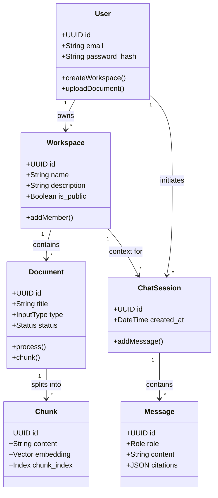

# Class Diagram — Personal Knowledge OS

## Overview
This diagram represents the core data structures and their relationships within the **Personal Knowledge OS**.

```mermaid
classDiagram
    class User {
        +UUID id
        +String email
        +String password_hash
        +createWorkspace()
        +uploadDocument()
    }

    class Workspace {
        +UUID id
        +String name
        +String description
        +Boolean is_public
        +addMember()
    }

    class Document {
        +UUID id
        +String title
        +InputType type
        +Status status
        +process()
        +chunk()
    }

    class Chunk {
        +UUID id
        +String content
        +Vector embedding
        +Index chunk_index
    }

    class ChatSession {
        +UUID id
        +DateTime created_at
        +addMessage()
    }

    class Message {
        +UUID id
        +Role role
        +String content
        +JSON citations
    }

    User "1" --> "*" Workspace : owns
    Workspace "1" --> "*" Document : contains
    Document "1" --> "*" Chunk : splits into
    User "1" --> "*" ChatSession : initiates
    Workspace "1" --> "*" ChatSession : context for
    ChatSession "1" --> "*" Message : contains
```
