# Class Diagram — OmniScript (Personal Knowledge OS)

## Overview
This diagram represents the **complete domain model** of OmniScript, including the core entities, agentic RAG components, knowledge graph, collaboration, and observability layers.

```mermaid
classDiagram
    %% ===== CORE IDENTITY =====
    class User {
        +UUID id
        +String email
        +String password_hash
        +String full_name
        +String avatar_url
        +AuthProvider auth_provider
        +Boolean mfa_enabled
        +register()
        +login()
        +enableMFA()
        +createWorkspace()
        +generateApiKey()
    }

    class Workspace {
        +UUID id
        +String name
        +String description
        +String icon
        +WorkspaceTemplate template
        +Boolean is_public
        +JSON settings
        +addMember()
        +removeMember()
        +getAnalytics()
        +searchDocuments()
    }

    class WorkspaceMember {
        +UUID workspace_id
        +UUID user_id
        +Role role
    }

    class ApiKey {
        +UUID id
        +String key_hash
        +String name
        +JSON permissions
        +DateTime expires_at
        +validate()
        +revoke()
    }

    %% ===== KNOWLEDGE BASE =====
    class Document {
        +UUID id
        +String title
        +String storage_url
        +SourceType source_type
        +ProcessingStatus status
        +String mime_type
        +Int token_count
        +JSON metadata
        +upload()
        +process()
        +reprocess()
        +delete()
    }

    class Chunk {
        +UUID id
        +String content
        +Vector embedding
        +Int chunk_index
        +Int token_count
        +String section_heading
        +JSON location
        +vectorSearch()
        +fullTextSearch()
    }

    %% ===== KNOWLEDGE GRAPH =====
    class KGEntity {
        +UUID id
        +String name
        +EntityType entity_type
        +String description
        +Int mention_count
        +JSON metadata
        +getRelationships()
        +getSourceChunks()
    }

    class KGEdge {
        +UUID id
        +String relationship
        +Float confidence
        +traverse()
    }

    %% ===== AGENTIC RAG =====
    class Agent {
        +plan(query)
        +selectTool(context)
        +evaluate(results)
        +retry(refinedQuery)
        +synthesize(chunks)
        +cite(sources)
    }

    class AgentTool {
        <<interface>>
        +String name
        +execute(input) output
    }

    class VectorSearchTool {
        +execute(query, workspaceId, topK)
    }

    class KeywordSearchTool {
        +execute(query, workspaceId)
    }

    class MetadataFilterTool {
        +execute(filters)
    }

    class GraphTraversalTool {
        +execute(entityName, depth)
    }

    class SummarizeTool {
        +execute(documentId)
    }

    class CompareTool {
        +execute(docId1, docId2)
    }

    %% ===== CONVERSATION =====
    class ChatSession {
        +UUID id
        +String title
        +UUID parent_session_id
        +Boolean is_pinned
        +addMessage()
        +branch()
        +export()
    }

    class Message {
        +UUID id
        +MessageRole role
        +String content
        +JSON citations
        +JSON tool_calls
        +JSON suggested_followups
        +Float confidence_score
        +Boolean is_bookmarked
        +bookmark()
    }

    class MessageFeedback {
        +UUID id
        +FeedbackRating rating
        +String comment
    }

    %% ===== ARTIFACTS =====
    class Artifact {
        +UUID id
        +ArtifactType artifact_type
        +String title
        +JSON content
        +String export_url
        +generate()
        +export()
    }

    %% ===== COLLABORATION =====
    class Annotation {
        +UUID id
        +String content
        +JSON highlight_range
    }

    class ActivityLog {
        +UUID id
        +ActivityAction action
        +String description
    }

    %% ===== OBSERVABILITY =====
    class AuditLog {
        +UUID id
        +String ip_address
        +AuditAction action
        +JSON details
    }

    class UsageMetrics {
        +UUID id
        +Date metric_date
        +Int queries_count
        +Int tokens_consumed
        +Float estimated_cost_usd
    }

    class Webhook {
        +UUID id
        +String url
        +WebhookEvent event
        +Boolean is_active
        +trigger()
    }

    %% ===== ENUMS =====
    class AuthProvider {
        <<enumeration>>
        LOCAL
        GOOGLE
        GITHUB
    }

    class SourceType {
        <<enumeration>>
        PDF
        MARKDOWN
        TEXT
        YOUTUBE
        WEB_URL
        AUDIO
        IMAGE
        CODE
        CSV
    }

    class ProcessingStatus {
        <<enumeration>>
        QUEUED
        PROCESSING
        CHUNKING
        EMBEDDING
        INDEXED
        FAILED
    }

    class MessageRole {
        <<enumeration>>
        USER
        ASSISTANT
        SYSTEM
        TOOL
    }

    class ArtifactType {
        <<enumeration>>
        SUMMARY
        FLASHCARD_SET
        MIND_MAP
        TIMELINE
        STUDY_GUIDE
        COMPARISON
        GLOSSARY
    }

    %% ===== RELATIONSHIPS =====

    %% Identity
    User "1" --> "*" Workspace : owns
    User "1" --> "*" WorkspaceMember : has memberships
    Workspace "1" --> "*" WorkspaceMember : has members
    User "1" --> "*" ApiKey : manages

    %% Knowledge Base
    Workspace "1" --> "*" Document : contains
    User "1" --> "*" Document : uploads
    Document "1" --> "*" Chunk : splits into

    %% Knowledge Graph
    Workspace "1" --> "*" KGEntity : has entities
    KGEntity "1" --> "*" KGEdge : source of
    KGEntity "1" --> "*" KGEdge : target of
    Chunk "*" --> "*" KGEntity : mentions

    %% Agentic RAG
    Agent "1" --> "*" AgentTool : uses
    AgentTool <|-- VectorSearchTool : implements
    AgentTool <|-- KeywordSearchTool : implements
    AgentTool <|-- MetadataFilterTool : implements
    AgentTool <|-- GraphTraversalTool : implements
    AgentTool <|-- SummarizeTool : implements
    AgentTool <|-- CompareTool : implements

    %% Conversation
    User "1" --> "*" ChatSession : initiates
    Workspace "1" --> "*" ChatSession : context for
    ChatSession "1" --> "*" Message : contains
    ChatSession "1" --> "0..*" ChatSession : branches into
    Message "1" --> "*" MessageFeedback : receives
    User "1" --> "*" MessageFeedback : provides

    %% Artifacts
    Workspace "1" --> "*" Artifact : has
    User "1" --> "*" Artifact : generates
    ChatSession "1" --> "*" Artifact : triggers

    %% Collaboration
    Workspace "1" --> "*" Annotation : has
    User "1" --> "*" Annotation : writes
    Workspace "1" --> "*" ActivityLog : tracks

    %% Observability
    User "1" --> "*" AuditLog : audited by
    User "1" --> "*" UsageMetrics : tracked
    User "1" --> "*" Webhook : configures
```

## Key Design Patterns

| Pattern | Where Used | Why |
|---|---|---|
| **Strategy Pattern** | `AgentTool` interface + concrete tools | Agent dynamically selects which retrieval tool to use |
| **Observer Pattern** | `Webhook` system | External systems get notified of events without polling |
| **Composite Pattern** | `ChatSession` self-reference (branching) | Tree-structured conversations |
| **Builder Pattern** | `Artifact.generate()` | Complex artifact generation with step-by-step construction |
| **Repository Pattern** | All database access | Clean separation between domain logic and data access |
