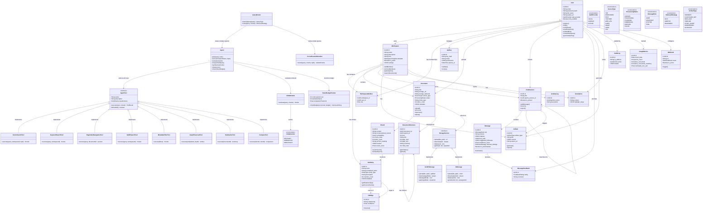

# Class Diagram — OmniScript

## Overview

Domain model covering core entities, modern retrieval pipeline (PageIndex, HyDE, CRAG), agentic tool system (Claude Code-inspired), knowledge graph, collaboration, and observability.

```mermaid
classDiagram
    %% ===== CORE IDENTITY =====
    class User {
        +UUID id
        +String email
        +String password_hash
        +String full_name
        +String avatar_url
        +AuthProvider auth_provider
        +Boolean mfa_enabled
        +register()
        +login()
        +verifyEmail()
        +resetPassword()
        +enableMFA()
        +createWorkspace()
        +generateApiKey()
    }

    class Workspace {
        +UUID id
        +String name
        +String description
        +String icon
        +WorkspaceTemplate template
        +Boolean is_public
        +JSON settings
        +addMember()
        +removeMember()
        +getAnalytics()
        +searchDocuments()
    }

    class WorkspaceMember {
        +UUID workspace_id
        +UUID user_id
        +Role role
    }

    class ApiKey {
        +UUID id
        +String key_hash
        +String name
        +JSON permissions
        +DateTime expires_at
        +validate()
        +revoke()
    }

    %% ===== KNOWLEDGE BASE =====
    class Document {
        +UUID id
        +String title
        +String storage_url
        +String storage_backend
        +SourceType source_type
        +ProcessingStatus status
        +String mime_type
        +Int token_count
        +JSON metadata
        +upload()
        +process()
        +reprocess()
        +delete()
    }

    class Chunk {
        +UUID id
        +String content
        +String contextualized_content
        +Vector embedding
        +Int chunk_index
        +Int token_count
        +String section_heading
        +JSON location
        +Float rerank_score
        +vectorSearch()
        +fullTextSearch()
    }

    class DocumentStructure {
        +UUID id
        +UUID document_id
        +UUID parent_id
        +Int level
        +String title
        +Int page_start
        +Int page_end
        +String summary
        +Int child_order
        +getChildren()
        +getPath()
    }

    %% ===== STORAGE ABSTRACTION =====
    class StorageService {
        <<interface>>
        +upload(file, path) url
        +download(url) stream
        +delete(url) void
        +getUrl(url, ttl) signedUrl
    }

    class GridFSStorage {
        +upload(file, path) gridfsId
        +download(gridfsId) stream
        +delete(gridfsId) void
        +getUrl(gridfsId) streamUrl
    }

    class S3Storage {
        +upload(file, path) s3Url
        +download(s3Url) stream
        +delete(s3Url) void
        +getUrl(s3Url, ttl) presignedUrl
    }

    %% ===== KNOWLEDGE GRAPH =====
    class KGEntity {
        +UUID id
        +String name
        +String normalized_name
        +EntityType entity_type
        +String description
        +Int mention_count
        +JSON metadata
        +getRelationships()
        +getSourceChunks()
    }

    class KGEdge {
        +UUID id
        +String relationship
        +Float confidence
        +traverse()
    }

    %% ===== MODERN RAG PIPELINE =====
    class QueryRouter {
        +classifyQuery(query) QueryType
        +route(query, context) RetrievalStrategy
    }

    class Agent {
        +plan(query, tools)
        +executeTool(toolName, input)
        +evaluate(results)
        +retry(refinedQuery)
        +synthesize(chunks)
        +cite(sources)
        +checkTokenBudget()
    }

    class CRAGGrader {
        +evaluate(query, chunks) Verdict
    }

    class AgentTool {
        <<interface>>
        +String name
        +String description
        +ZodSchema inputSchema
        +execute(input, context) ToolResult
        +isEnabled() boolean
    }

    class VectorSearchTool {
        +execute(query, workspaceId, topK) chunks
    }

    class KeywordSearchTool {
        +execute(query, workspaceId) chunks
    }

    class PageIndexNavigationTool {
        +execute(query, documentId) sections
    }

    class HyDESearchTool {
        +execute(query, workspaceId) chunks
    }

    class MetadataFilterTool {
        +execute(filters) chunks
    }

    class GraphTraversalTool {
        +execute(entityName, depth) entities
    }

    class SummarizeTool {
        +execute(documentId) summary
    }

    class CompareTool {
        +execute(docId1, docId2) comparison
    }

    class CrossEncoderReranker {
        +rerank(query, chunks, topK) rankedChunks
    }

    class TokenBudgetTracker {
        +Int continuationCount
        +Int lastDeltaTokens
        +Float completionThreshold
        +checkBudget(consumed, budget) ContinueOrStop
    }

    %% ===== CONVERSATION =====
    class ChatSession {
        +UUID id
        +String title
        +UUID parent_session_id
        +Boolean is_pinned
        +addMessage()
        +branch()
        +export()
    }

    class Message {
        +UUID id
        +MessageRole role
        +String content
        +JSON citations
        +JSON tool_calls
        +JSON suggested_followups
        +Float confidence_score
        +RetrievalStrategy retrieval_strategy
        +Boolean is_bookmarked
        +bookmark()
    }

    class MessageFeedback {
        +UUID id
        +FeedbackRating rating
        +String comment
    }

    %% ===== ARTIFACTS =====
    class Artifact {
        +UUID id
        +ArtifactType artifact_type
        +String title
        +JSON content
        +String export_url
        +generate()
        +export()
    }

    %% ===== COLLABORATION =====
    class Annotation {
        +UUID id
        +String content
        +JSON highlight_range
    }

    class ActivityLog {
        +UUID id
        +ActivityAction action
        +String description
    }

    %% ===== OBSERVABILITY =====
    class AuditLog {
        +UUID id
        +String ip_address
        +AuditAction action
        +JSON details
    }

    class UsageMetrics {
        +UUID id
        +Date metric_date
        +Int queries_count
        +Int tokens_consumed
        +Int tokens_consumed_reranking
        +Float estimated_cost_usd
    }

    class Webhook {
        +UUID id
        +String url
        +WebhookEvent event
        +Boolean is_active
        +trigger()
    }

    %% ===== ENUMS =====
    class AuthProvider {
        <<enumeration>>
        LOCAL
        GOOGLE
        GITHUB
    }

    class SourceType {
        <<enumeration>>
        PDF
        MARKDOWN
        TEXT
        YOUTUBE
        WEB_URL
        AUDIO
        IMAGE
        CODE
        CSV
    }

    class ProcessingStatus {
        <<enumeration>>
        QUEUED
        PROCESSING
        CHUNKING
        EMBEDDING
        INDEXED
        FAILED
    }

    class MessageRole {
        <<enumeration>>
        USER
        ASSISTANT
        SYSTEM
        TOOL
    }

    class RetrievalStrategy {
        <<enumeration>>
        FAST
        AGENTIC
        PAGEINDEX
    }

    class CRAGVerdict {
        <<enumeration>>
        RELEVANT
        AMBIGUOUS
        IRRELEVANT
    }

    class ArtifactType {
        <<enumeration>>
        SUMMARY
        FLASHCARD_SET
        MIND_MAP
        TIMELINE
        STUDY_GUIDE
        COMPARISON
        GLOSSARY
    }

    %% ===== RELATIONSHIPS =====

    %% Identity
    User "1" --> "*" Workspace : owns
    User "1" --> "*" WorkspaceMember : has memberships
    Workspace "1" --> "*" WorkspaceMember : has members
    User "1" --> "*" ApiKey : manages

    %% Knowledge Base
    Workspace "1" --> "*" Document : contains
    User "1" --> "*" Document : uploads
    Document "1" --> "*" Chunk : splits into
    Document "1" --> "*" DocumentStructure : structured as
    DocumentStructure "1" --> "*" DocumentStructure : has children

    %% Storage
    StorageService <|-- GridFSStorage : implements
    StorageService <|-- S3Storage : implements
    Document --> StorageService : stored via

    %% Knowledge Graph
    Workspace "1" --> "*" KGEntity : has entities
    KGEntity "1" --> "*" KGEdge : source of
    KGEntity "1" --> "*" KGEdge : target of
    Chunk "*" --> "*" KGEntity : mentions

    %% Modern RAG Pipeline
    QueryRouter --> Agent : routes complex queries
    QueryRouter --> CrossEncoderReranker : routes simple queries
    Agent "1" --> "*" AgentTool : selects and uses
    Agent --> CRAGGrader : evaluates retrieval
    Agent --> TokenBudgetTracker : monitors budget
    AgentTool <|-- VectorSearchTool : implements
    AgentTool <|-- KeywordSearchTool : implements
    AgentTool <|-- PageIndexNavigationTool : implements
    AgentTool <|-- HyDESearchTool : implements
    AgentTool <|-- MetadataFilterTool : implements
    AgentTool <|-- GraphTraversalTool : implements
    AgentTool <|-- SummarizeTool : implements
    AgentTool <|-- CompareTool : implements
    CRAGGrader --> CRAGVerdict : returns

    %% Conversation
    User "1" --> "*" ChatSession : initiates
    Workspace "1" --> "*" ChatSession : context for
    ChatSession "1" --> "*" Message : contains
    ChatSession "1" --> "0..*" ChatSession : branches into
    Message "1" --> "*" MessageFeedback : receives
    User "1" --> "*" MessageFeedback : provides

    %% Artifacts
    Workspace "1" --> "*" Artifact : has
    User "1" --> "*" Artifact : generates
    ChatSession "1" --> "*" Artifact : triggers

    %% Collaboration
    Workspace "1" --> "*" Annotation : has
    User "1" --> "*" Annotation : writes
    Workspace "1" --> "*" ActivityLog : tracks

    %% Observability
    User "1" --> "*" AuditLog : audited by
    User "1" --> "*" UsageMetrics : tracked
    User "1" --> "*" Webhook : configures
```

## Key Design Patterns

| Pattern                | Where Used                                                   | Why                                                              |
| ---------------------- | ------------------------------------------------------------ | ---------------------------------------------------------------- |
| **Strategy Pattern**   | `AgentTool` interface + concrete tools                       | Agent dynamically selects which retrieval tool to use            |
| **Strategy Pattern**   | `StorageService` + GridFS/S3                                 | Swap file storage backend via config                             |
| **Strategy Pattern**   | `QueryRouter` + Fast/Agentic/PageIndex paths                 | Adaptive routing based on query complexity                       |
| **Builder Pattern**    | `buildTool()` helper (Claude Code-inspired)                  | Provide defaults, ensure consistent tool interface               |
| **Registry Pattern**   | `tool-registry.ts` central tool list                         | Single source of truth for all available tools                   |
| **Observer Pattern**   | `Webhook` system                                             | External systems get notified of events without polling          |
| **Composite Pattern**  | `ChatSession` self-reference (branching)                     | Tree-structured conversations                                    |
| **Composite Pattern**  | `DocumentStructure` self-reference (PageIndex)               | Tree-structured document hierarchy for navigation                |
| **Builder Pattern**    | `Artifact.generate()`                                        | Complex artifact generation with step-by-step construction       |
| **Repository Pattern** | All database access via services                             | Clean separation between domain logic and data access            |
| **Chain of Responsibility** | Query → Hybrid → Rerank → CRAG → Synthesize           | Multi-stage retrieval with each stage filtering/improving        |
| **Token Budget**       | `TokenBudgetTracker` (Claude Code-inspired)                  | Prevent runaway LLM costs with diminishing-returns detection     |
