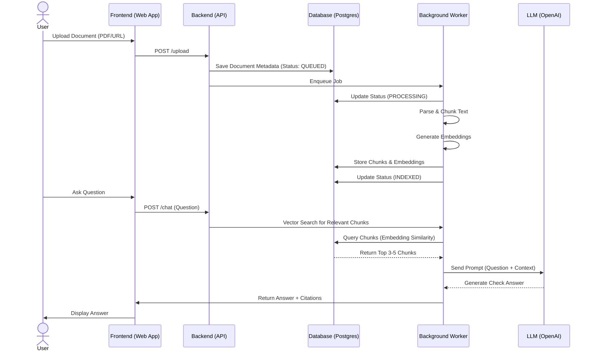

# Sequence Diagram — Personal Knowledge OS

## Overview
This diagram illustrates the end-to-end flow of the **Personal Knowledge OS**, from user login to asking a question and receiving an answer.

