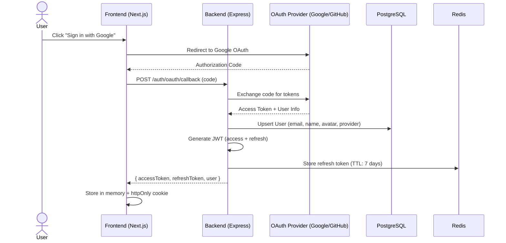
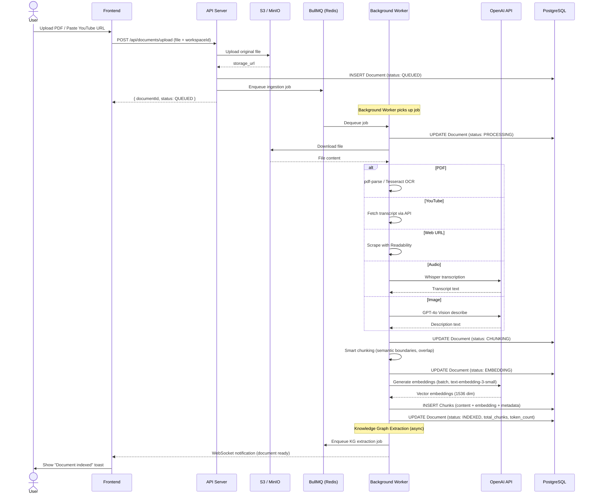
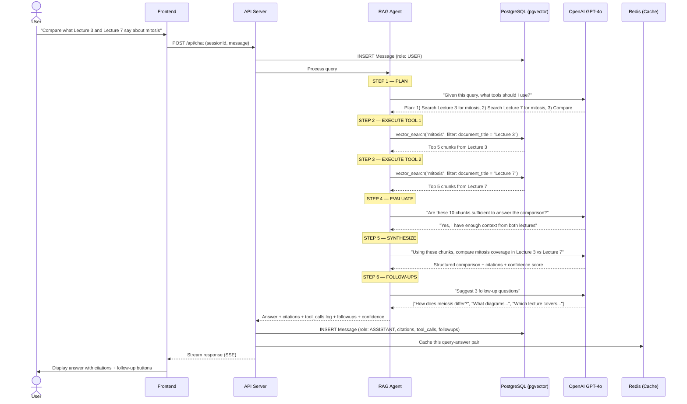
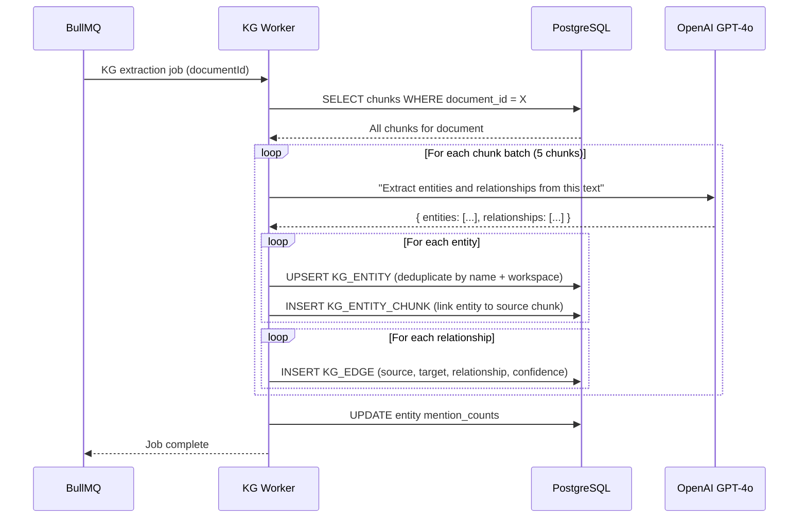
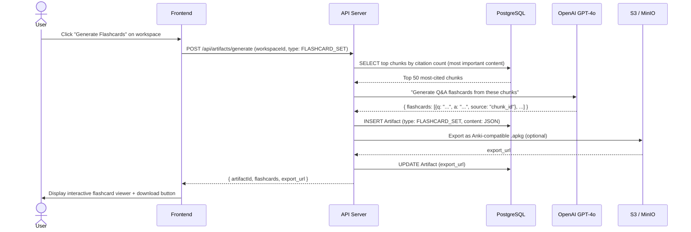

# Sequence Diagrams — OmniScript

## Overview

End-to-end flows covering authentication, document ingestion, agentic RAG chat, knowledge graph construction, and artifact generation.

---

## 1. User Authentication (OAuth + JWT)

---

## 2. Document Upload & Processing Pipeline

---

## 3. Agentic RAG Chat Flow

---

## 4. Knowledge Graph Construction

---

## 5. Artifact Generation (Flashcards Example)

