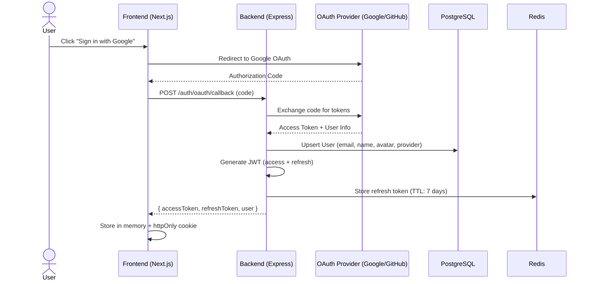
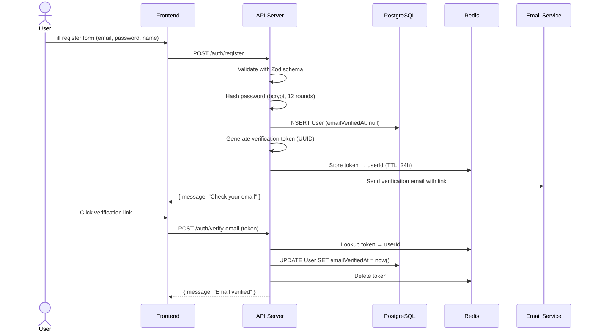
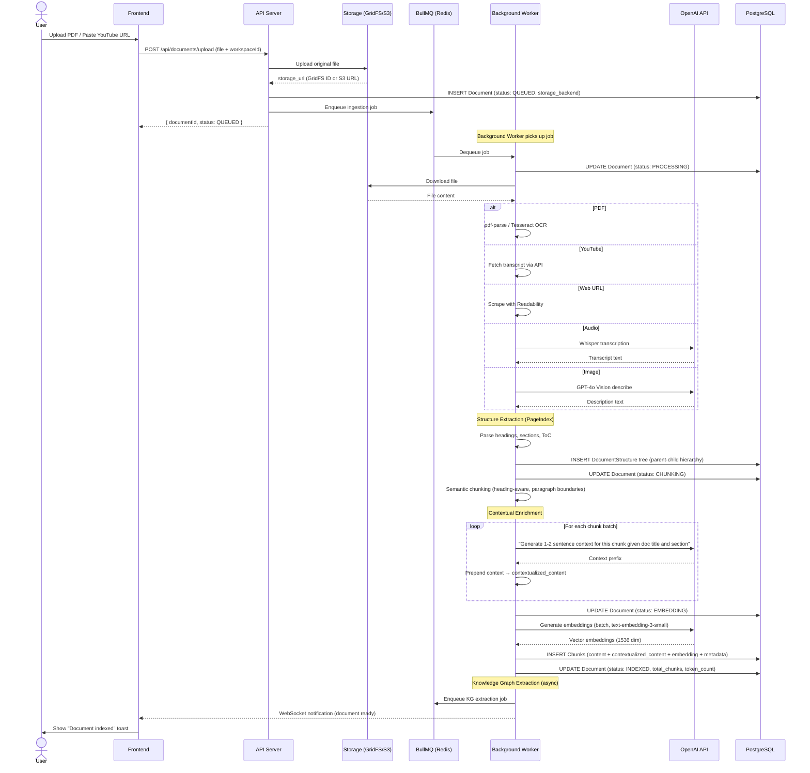
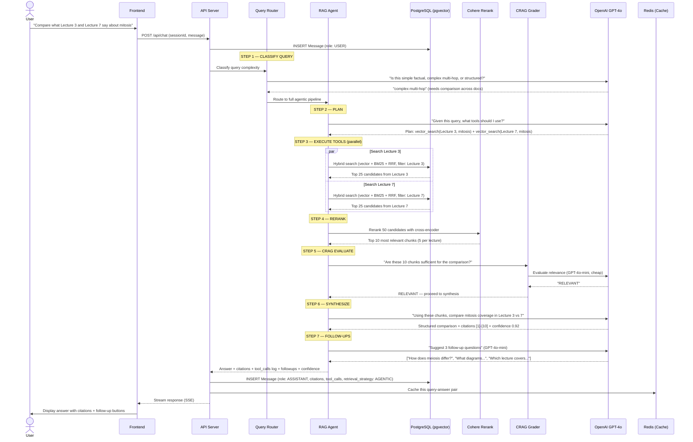
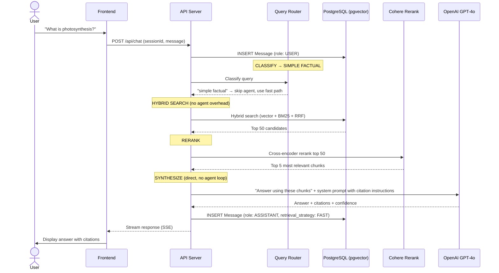
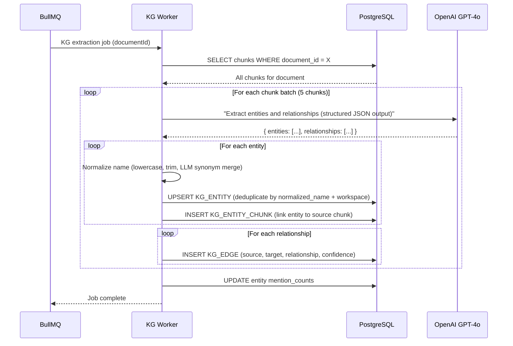
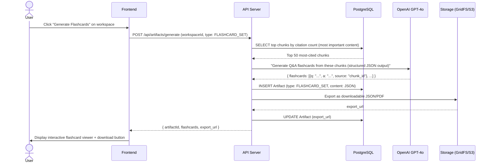
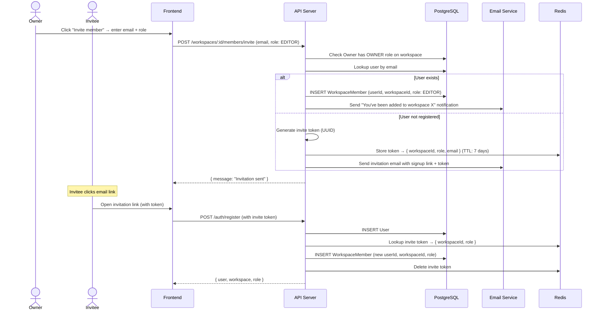

# Sequence Diagrams — OmniScript

## Overview

End-to-end flows covering authentication, document ingestion with contextual enrichment, modern RAG chat with adaptive routing and reranking, knowledge graph construction, and artifact generation.

---

## 1. User Authentication (OAuth + JWT)

```mermaid
sequenceDiagram
    actor User
    participant Frontend as Frontend (Next.js)
    participant Backend as Backend (Express)
    participant OAuth as OAuth Provider (Google/GitHub)
    participant DB as PostgreSQL
    participant Redis as Redis

    User->>Frontend: Click "Sign in with Google"
    Frontend->>OAuth: Redirect to Google OAuth
    OAuth-->>Frontend: Authorization Code
    Frontend->>Backend: POST /auth/oauth/callback (code)
    Backend->>OAuth: Exchange code for tokens
    OAuth-->>Backend: Access Token + User Info
    Backend->>DB: Upsert User (email, name, avatar, provider)
    Backend->>Backend: Generate JWT (access + refresh)
    Backend->>Redis: Store refresh token (TTL: 7 days)
    Backend-->>Frontend: { accessToken, refreshToken, user }
    Frontend->>Frontend: Store in memory + httpOnly cookie
```

---

## 2. Email Registration with Verification

```mermaid
sequenceDiagram
    actor User
    participant Frontend as Frontend
    participant Backend as API Server
    participant DB as PostgreSQL
    participant Redis as Redis
    participant Email as Email Service

    User->>Frontend: Fill register form (email, password, name)
    Frontend->>Backend: POST /auth/register
    Backend->>Backend: Validate with Zod schema
    Backend->>Backend: Hash password (bcrypt, 12 rounds)
    Backend->>DB: INSERT User (emailVerifiedAt: null)
    Backend->>Backend: Generate verification token (UUID)
    Backend->>Redis: Store token → userId (TTL: 24h)
    Backend->>Email: Send verification email with link
    Backend-->>Frontend: { message: "Check your email" }

    User->>Frontend: Click verification link
    Frontend->>Backend: POST /auth/verify-email (token)
    Backend->>Redis: Lookup token → userId
    Backend->>DB: UPDATE User SET emailVerifiedAt = now()
    Backend->>Redis: Delete token
    Backend-->>Frontend: { message: "Email verified" }
```

---

## 3. Document Upload & Processing Pipeline (with PageIndex + Contextual Enrichment)

```mermaid
sequenceDiagram
    actor User
    participant Frontend as Frontend
    participant Backend as API Server
    participant Storage as Storage (GridFS/S3)
    participant Queue as BullMQ (Redis)
    participant Worker as Background Worker
    participant AI as OpenAI API
    participant DB as PostgreSQL

    User->>Frontend: Upload PDF / Paste YouTube URL
    Frontend->>Backend: POST /api/documents/upload (file + workspaceId)
    Backend->>Storage: Upload original file
    Storage-->>Backend: storage_url (GridFS ID or S3 URL)
    Backend->>DB: INSERT Document (status: QUEUED, storage_backend)
    Backend->>Queue: Enqueue ingestion job
    Backend-->>Frontend: { documentId, status: QUEUED }

    Note over Worker: Background Worker picks up job

    Queue->>Worker: Dequeue job
    Worker->>DB: UPDATE Document (status: PROCESSING)
    Worker->>Storage: Download file
    Storage-->>Worker: File content

    alt PDF
        Worker->>Worker: pdf-parse / Tesseract OCR
    else YouTube
        Worker->>Worker: Fetch transcript via API
    else Web URL
        Worker->>Worker: Scrape with Readability
    else Audio
        Worker->>AI: Whisper transcription
        AI-->>Worker: Transcript text
    else Image
        Worker->>AI: GPT-4o Vision describe
        AI-->>Worker: Description text
    end

    Note over Worker: Structure Extraction (PageIndex)
    Worker->>Worker: Parse headings, sections, ToC
    Worker->>DB: INSERT DocumentStructure tree (parent-child hierarchy)

    Worker->>DB: UPDATE Document (status: CHUNKING)
    Worker->>Worker: Semantic chunking (heading-aware, paragraph boundaries)

    Note over Worker: Contextual Enrichment
    loop For each chunk batch
        Worker->>AI: "Generate 1-2 sentence context for this chunk given doc title and section"
        AI-->>Worker: Context prefix
        Worker->>Worker: Prepend context → contextualized_content
    end

    Worker->>DB: UPDATE Document (status: EMBEDDING)
    Worker->>AI: Generate embeddings (batch, text-embedding-3-small)
    AI-->>Worker: Vector embeddings (1536 dim)
    Worker->>DB: INSERT Chunks (content + contextualized_content + embedding + metadata)
    Worker->>DB: UPDATE Document (status: INDEXED, total_chunks, token_count)

    Note over Worker: Knowledge Graph Extraction (async)
    Worker->>Queue: Enqueue KG extraction job
    Worker-->>Frontend: WebSocket notification (document ready)
    Frontend->>User: Show "Document indexed" toast
```

---

## 4. Modern RAG Chat Flow (Adaptive Routing + Reranking + CRAG)

```mermaid
sequenceDiagram
    actor User
    participant Frontend as Frontend
    participant Backend as API Server
    participant Router as Query Router
    participant Agent as RAG Agent
    participant DB as PostgreSQL (pgvector)
    participant Reranker as Cohere Rerank
    participant Grader as CRAG Grader
    participant LLM as OpenAI GPT-4o
    participant Redis as Redis (Cache)

    User->>Frontend: "Compare what Lecture 3 and Lecture 7 say about mitosis"
    Frontend->>Backend: POST /api/chat (sessionId, message)
    Backend->>DB: INSERT Message (role: USER)

    Note over Router: STEP 1 — CLASSIFY QUERY
    Backend->>Router: Classify query complexity
    Router->>LLM: "Is this simple factual, complex multi-hop, or structured?"
    LLM-->>Router: "complex multi-hop" (needs comparison across docs)
    Router->>Agent: Route to full agentic pipeline

    Note over Agent: STEP 2 — PLAN
    Agent->>LLM: "Given this query, what tools should I use?"
    LLM-->>Agent: Plan: vector_search(Lecture 3, mitosis) + vector_search(Lecture 7, mitosis)

    Note over Agent: STEP 3 — EXECUTE TOOLS (parallel)
    par Search Lecture 3
        Agent->>DB: Hybrid search (vector + BM25 + RRF, filter: Lecture 3)
        DB-->>Agent: Top 25 candidates from Lecture 3
    and Search Lecture 7
        Agent->>DB: Hybrid search (vector + BM25 + RRF, filter: Lecture 7)
        DB-->>Agent: Top 25 candidates from Lecture 7
    end

    Note over Agent: STEP 4 — RERANK
    Agent->>Reranker: Rerank 50 candidates with cross-encoder
    Reranker-->>Agent: Top 10 most relevant chunks (5 per lecture)

    Note over Agent: STEP 5 — CRAG EVALUATE
    Agent->>Grader: "Are these 10 chunks sufficient for the comparison?"
    Grader->>LLM: Evaluate relevance (GPT-4o-mini, cheap)
    LLM-->>Grader: "RELEVANT"
    Grader-->>Agent: RELEVANT — proceed to synthesis

    Note over Agent: STEP 6 — SYNTHESIZE
    Agent->>LLM: "Using these chunks, compare mitosis coverage in Lecture 3 vs 7"
    LLM-->>Agent: Structured comparison + citations [1]-[10] + confidence 0.92

    Note over Agent: STEP 7 — FOLLOW-UPS
    Agent->>LLM: "Suggest 3 follow-up questions" (GPT-4o-mini)
    LLM-->>Agent: ["How does meiosis differ?", "What diagrams...", "Which lecture covers..."]

    Agent-->>Backend: Answer + citations + tool_calls log + followups + confidence
    Backend->>DB: INSERT Message (role: ASSISTANT, citations, tool_calls, retrieval_strategy: AGENTIC)
    Backend->>Redis: Cache this query-answer pair
    Backend-->>Frontend: Stream response (SSE)
    Frontend->>User: Display answer with citations + follow-up buttons
```

---

## 5. Fast Path (Simple Query — No Agent)

```mermaid
sequenceDiagram
    actor User
    participant Frontend as Frontend
    participant Backend as API Server
    participant Router as Query Router
    participant DB as PostgreSQL (pgvector)
    participant Reranker as Cohere Rerank
    participant LLM as OpenAI GPT-4o

    User->>Frontend: "What is photosynthesis?"
    Frontend->>Backend: POST /api/chat (sessionId, message)
    Backend->>DB: INSERT Message (role: USER)

    Note over Router: CLASSIFY → SIMPLE FACTUAL
    Backend->>Router: Classify query
    Router-->>Backend: "simple factual" → skip agent, use fast path

    Note over Backend: HYBRID SEARCH (no agent overhead)
    Backend->>DB: Hybrid search (vector + BM25 + RRF)
    DB-->>Backend: Top 50 candidates

    Note over Backend: RERANK
    Backend->>Reranker: Cross-encoder rerank top 50
    Reranker-->>Backend: Top 5 most relevant chunks

    Note over Backend: SYNTHESIZE (direct, no agent loop)
    Backend->>LLM: "Answer using these chunks" + system prompt with citation instructions
    LLM-->>Backend: Answer + citations + confidence

    Backend->>DB: INSERT Message (role: ASSISTANT, retrieval_strategy: FAST)
    Backend-->>Frontend: Stream response (SSE)
    Frontend->>User: Display answer with citations
```

---

## 6. Knowledge Graph Construction

```mermaid
sequenceDiagram
    participant Queue as BullMQ
    participant Worker as KG Worker
    participant DB as PostgreSQL
    participant LLM as OpenAI GPT-4o

    Queue->>Worker: KG extraction job (documentId)
    Worker->>DB: SELECT chunks WHERE document_id = X
    DB-->>Worker: All chunks for document

    loop For each chunk batch (5 chunks)
        Worker->>LLM: "Extract entities and relationships (structured JSON output)"
        LLM-->>Worker: { entities: [...], relationships: [...] }

        loop For each entity
            Worker->>Worker: Normalize name (lowercase, trim, LLM synonym merge)
            Worker->>DB: UPSERT KG_ENTITY (deduplicate by normalized_name + workspace)
            Worker->>DB: INSERT KG_ENTITY_CHUNK (link entity to source chunk)
        end

        loop For each relationship
            Worker->>DB: INSERT KG_EDGE (source, target, relationship, confidence)
        end
    end

    Worker->>DB: UPDATE entity mention_counts
    Worker-->>Queue: Job complete
```

---

## 7. Artifact Generation (Flashcards Example)

```mermaid
sequenceDiagram
    actor User
    participant Frontend as Frontend
    participant Backend as API Server
    participant DB as PostgreSQL
    participant LLM as OpenAI GPT-4o
    participant Storage as Storage (GridFS/S3)

    User->>Frontend: Click "Generate Flashcards" on workspace
    Frontend->>Backend: POST /api/artifacts/generate (workspaceId, type: FLASHCARD_SET)
    Backend->>DB: SELECT top chunks by citation count (most important content)
    DB-->>Backend: Top 50 most-cited chunks

    Backend->>LLM: "Generate Q&A flashcards from these chunks (structured JSON output)"
    LLM-->>Backend: { flashcards: [{q: "...", a: "...", source: "chunk_id"}, ...] }

    Backend->>DB: INSERT Artifact (type: FLASHCARD_SET, content: JSON)
    Backend->>Storage: Export as downloadable JSON/PDF
    Storage-->>Backend: export_url
    Backend->>DB: UPDATE Artifact (export_url)
    Backend-->>Frontend: { artifactId, flashcards, export_url }
    Frontend->>User: Display interactive flashcard viewer + download button
```

---

## 8. Workspace Sharing & RBAC Flow

```mermaid
sequenceDiagram
    actor Owner
    actor Invitee
    participant Frontend as Frontend
    participant Backend as API Server
    participant DB as PostgreSQL
    participant Email as Email Service
    participant Redis as Redis

    Owner->>Frontend: Click "Invite member" → enter email + role
    Frontend->>Backend: POST /workspaces/:id/members/invite (email, role: EDITOR)
    Backend->>DB: Check Owner has OWNER role on workspace
    Backend->>DB: Lookup user by email

    alt User exists
        Backend->>DB: INSERT WorkspaceMember (userId, workspaceId, role: EDITOR)
        Backend->>Email: Send "You've been added to workspace X" notification
    else User not registered
        Backend->>Backend: Generate invite token (UUID)
        Backend->>Redis: Store token → { workspaceId, role, email } (TTL: 7 days)
        Backend->>Email: Send invitation email with signup link + token
    end

    Backend-->>Frontend: { message: "Invitation sent" }

    Note over Invitee: Invitee clicks email link
    Invitee->>Frontend: Open invitation link (with token)
    Frontend->>Backend: POST /auth/register (with invite token)
    Backend->>DB: INSERT User
    Backend->>Redis: Lookup invite token → { workspaceId, role }
    Backend->>DB: INSERT WorkspaceMember (new userId, workspaceId, role)
    Backend->>Redis: Delete invite token
    Backend-->>Frontend: { user, workspace, role }
```
