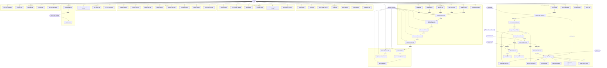

# Use Case Diagram — OmniScript

## Overview

All interactions between the User, System Workers, Query Router, RAG Agent, CRAG Grader, LLM, and External integrations.

```mermaid
flowchart TD
    %% ===== ACTORS =====
    U(["👤 User"])
    S(["⚙️ System / Workers"])
    QR(["🔀 Query Router"])
    AG(["🤖 RAG Agent"])
    CG(["✅ CRAG Grader"])
    LLM(["🧠 LLM (GPT-4o)"])
    RR(["📊 Cross-Encoder Reranker"])
    EXT(["🔌 External (API / Webhook)"])

    %% ===== AUTHENTICATION =====
    subgraph Auth ["🔐 Authentication"]
        UC_REG["Register (Email)"]
        UC_VERIFY["Verify Email"]
        UC_OAUTH["Sign in (Google / GitHub)"]
        UC_MFA["Enable MFA"]
        UC_FORGOT["Forgot Password"]
        UC_RESET["Reset Password"]
        UC_APIKEY["Generate API Key"]
    end

    %% ===== WORKSPACE MANAGEMENT =====
    subgraph WS ["📁 Workspace Management"]
        UC_CW["Create Workspace"]
        UC_CW_TPL["Use Workspace Template"]
        UC_INVITE["Invite Members"]
        UC_RBAC["Set Member Roles"]
        UC_WS_SETTINGS["Configure Workspace Settings"]
        UC_WS_ANALYTICS["View Workspace Analytics"]
    end

    %% ===== DOCUMENT INGESTION =====
    subgraph DOC ["📄 Document Ingestion"]
        UC_UPLOAD["Upload Document"]
        UC_UPLOAD_YT["Paste YouTube URL"]
        UC_UPLOAD_WEB["Paste Web URL"]
        UC_UPLOAD_AUDIO["Upload Audio File"]
        UC_UPLOAD_IMG["Upload Image"]
        UC_INGEST["Ingest & Parse Content"]
        UC_STRUCTURE["Extract Document Structure (PageIndex)"]
        UC_CHUNK["Semantic Chunking"]
        UC_CONTEXT["Contextual Enrichment"]
        UC_EMBED["Generate Embeddings"]
        UC_REPROCESS["Re-process Document"]
    end

    %% ===== AI CHAT (MODERN RAG) =====
    subgraph CHAT ["💬 AI Chat (Modern RAG)"]
        UC_ASK["Ask Question"]
        UC_CLASSIFY["Classify Query Complexity"]
        UC_FAST["Fast Path (Simple Query)"]
        UC_PLAN["Agent Plans Strategy"]
        UC_VSEARCH["Vector Search (Semantic)"]
        UC_KSEARCH["Keyword Search (BM25)"]
        UC_FILTER["Filter by Metadata"]
        UC_PAGEINDEX["PageIndex Navigation"]
        UC_HYDE["HyDE Search (Hypothetical)"]
        UC_GRAPH_SEARCH["Graph Traversal Search"]
        UC_HYBRID["Hybrid Merge (RRF)"]
        UC_RERANK["Cross-Encoder Rerank"]
        UC_EVALUATE["CRAG Evaluate Results"]
        UC_RETRY["Retry (Refined Query)"]
        UC_GENERATE["Generate Answer"]
        UC_CITE["Attach Citations"]
        UC_FOLLOWUP["Suggest Follow-ups"]
        UC_BRANCH["Branch Conversation"]
        UC_BOOKMARK["Bookmark Answer"]
        UC_EXPORT_CHAT["Export Chat"]
    end

    %% ===== KNOWLEDGE GRAPH =====
    subgraph KG ["🧠 Knowledge Graph"]
        UC_EXTRACT["Extract Entities"]
        UC_NORMALIZE["Normalize & Deduplicate"]
        UC_MAP_REL["Map Relationships"]
        UC_EXPLORE["Explore Graph Visually"]
        UC_GAP["Detect Knowledge Gaps"]
    end

    %% ===== ARTIFACTS =====
    subgraph ART ["📊 Artifacts"]
        UC_SUMMARY["Generate Summary"]
        UC_FLASH["Generate Flashcards"]
        UC_MINDMAP["Generate Mind Map"]
        UC_TIMELINE["Generate Timeline"]
        UC_STUDYGUIDE["Generate Study Guide"]
        UC_COMPARE["Compare Documents"]
        UC_GLOSSARY["Generate Glossary"]
        UC_EXPORT_ART["Export Artifact (PDF/MD)"]
    end

    %% ===== COLLABORATION =====
    subgraph COLLAB ["👥 Collaboration"]
        UC_ANNOTATE["Annotate Document / Answer"]
        UC_ACTIVITY["View Activity Feed"]
        UC_LIVE["Live Chat (WebSocket)"]
    end

    %% ===== INTEGRATIONS =====
    subgraph INTEG ["🔌 Integrations"]
        UC_WEBHOOK["Configure Webhooks"]
        UC_REST_API["Use REST API"]
    end

    %% ===== OBSERVABILITY =====
    subgraph OBS ["📈 Observability"]
        UC_USAGE["View Usage Dashboard"]
        UC_COST["Track API Costs"]
        UC_AUDIT["View Audit Logs"]
        UC_FEEDBACK["Rate AI Answer"]
        UC_QUALITY["View RAG Quality Metrics"]
    end

    %% ===== USER INTERACTIONS =====
    U --> UC_REG
    U --> UC_VERIFY
    U --> UC_OAUTH
    U --> UC_MFA
    U --> UC_FORGOT
    U --> UC_APIKEY
    U --> UC_CW
    U --> UC_CW_TPL
    U --> UC_INVITE
    U --> UC_RBAC
    U --> UC_WS_SETTINGS
    U --> UC_WS_ANALYTICS
    U --> UC_UPLOAD
    U --> UC_UPLOAD_YT
    U --> UC_UPLOAD_WEB
    U --> UC_UPLOAD_AUDIO
    U --> UC_UPLOAD_IMG
    U --> UC_REPROCESS
    U --> UC_ASK
    U --> UC_BRANCH
    U --> UC_BOOKMARK
    U --> UC_EXPORT_CHAT
    U --> UC_EXPLORE
    U --> UC_SUMMARY
    U --> UC_FLASH
    U --> UC_MINDMAP
    U --> UC_TIMELINE
    U --> UC_STUDYGUIDE
    U --> UC_COMPARE
    U --> UC_GLOSSARY
    U --> UC_EXPORT_ART
    U --> UC_ANNOTATE
    U --> UC_ACTIVITY
    U --> UC_LIVE
    U --> UC_WEBHOOK
    U --> UC_USAGE
    U --> UC_COST
    U --> UC_AUDIT
    U --> UC_FEEDBACK
    U --> UC_QUALITY

    %% ===== SYSTEM INTERACTIONS =====
    UC_UPLOAD -->|triggers| UC_INGEST
    UC_UPLOAD_YT -->|triggers| UC_INGEST
    UC_UPLOAD_WEB -->|triggers| UC_INGEST
    UC_UPLOAD_AUDIO -->|triggers| UC_INGEST
    UC_UPLOAD_IMG -->|triggers| UC_INGEST
    S --> UC_INGEST
    UC_INGEST -->|include| UC_STRUCTURE
    S --> UC_STRUCTURE
    UC_STRUCTURE -->|include| UC_CHUNK
    S --> UC_CHUNK
    UC_CHUNK -->|include| UC_CONTEXT
    S --> UC_CONTEXT
    UC_CONTEXT -->|include| UC_EMBED
    S --> UC_EMBED
    UC_EMBED -->|triggers| UC_EXTRACT
    S --> UC_EXTRACT
    UC_EXTRACT -->|include| UC_NORMALIZE
    UC_NORMALIZE -->|include| UC_MAP_REL
    S --> UC_MAP_REL

    %% ===== MODERN RAG FLOW =====
    UC_ASK -->|triggers| UC_CLASSIFY
    QR --> UC_CLASSIFY

    UC_CLASSIFY -->|simple query| UC_FAST
    UC_FAST -->|include| UC_HYBRID
    UC_HYBRID -->|include| UC_RERANK
    RR --> UC_RERANK
    UC_RERANK -->|sufficient| UC_GENERATE

    UC_CLASSIFY -->|complex query| UC_PLAN
    AG --> UC_PLAN
    UC_PLAN -->|selects| UC_VSEARCH
    UC_PLAN -->|selects| UC_KSEARCH
    UC_PLAN -->|selects| UC_FILTER
    UC_PLAN -->|selects| UC_PAGEINDEX
    UC_PLAN -->|selects| UC_HYDE
    UC_PLAN -->|selects| UC_GRAPH_SEARCH
    UC_VSEARCH -->|merge| UC_HYBRID
    UC_KSEARCH -->|merge| UC_HYBRID

    UC_RERANK -->|evaluate| UC_EVALUATE
    CG --> UC_EVALUATE
    UC_EVALUATE -->|IRRELEVANT| UC_RETRY
    UC_RETRY -->|loops back| UC_PLAN
    UC_EVALUATE -->|RELEVANT| UC_GENERATE
    LLM --> UC_GENERATE
    UC_GENERATE -->|include| UC_CITE
    UC_GENERATE -->|include| UC_FOLLOWUP

    %% ===== EXTERNAL INTEGRATIONS =====
    EXT --> UC_REST_API
    UC_WEBHOOK -->|notifies| EXT

    %% ===== KNOWLEDGE GAP =====
    UC_EXPLORE -->|include| UC_GAP
    S --> UC_GAP
```

---

## Actor Descriptions

| Actor                       | Description                                                                             |
| --------------------------- | --------------------------------------------------------------------------------------- |
| **👤 User**                 | End user interacting via the web app                                                    |
| **⚙️ System / Workers**    | Background workers handling async processing (ingestion, embedding, KG extraction)      |
| **🔀 Query Router**        | Adaptive router that classifies queries and selects fast or agentic retrieval path       |
| **🤖 RAG Agent**           | The agentic AI orchestrator that plans, selects tools, executes, and retries             |
| **✅ CRAG Grader**          | Self-correcting evaluator that grades retrieval quality (RELEVANT/AMBIGUOUS/IRRELEVANT)  |
| **🧠 LLM (GPT-4o)**       | The language model used for generation, extraction, and evaluation                      |
| **📊 Cross-Encoder Reranker** | Cohere Rerank API that reranks top-50 candidates to find the most precise chunks     |
| **🔌 External**            | External systems interacting via API or webhooks                                         |
