# Use Case Diagram — Personal Knowledge OS

## Overview
This diagram illustrates the interactions between the **User**, **System (Background Processor)**, and the **LLM** (Language Model) within the Personal Knowledge OS.

```mermaid
flowchart TD
    %% Actors
    U(["👤 User"])
    S(["⚙️ System / Background Worker"])
    AI(["🤖 LLM (AI Model)"])

    %% Use Cases
    UC1["Create Workspace"]
    UC2["Upload Document"]
    UC3["Ingest Document"]
    UC4["Generate Embeddings"]
    UC5["Ask Question"]
    UC6["Search Relevant Chunks"]
    UC7["Generate Answer"]
    UC8["View Citation"]

    %% User interactions
    U --> UC1
    U --> UC2
    U --> UC5
    U --> UC8

    %% System interactions
    UC2 -->|triggers| UC3
    S --> UC3
    UC3 -->|include| UC4
    S --> UC4

    %% Chat flow
    UC5 -->|include| UC6
    S --> UC6
    UC6 -->|include| UC7
    AI --> UC7
    UC7 -->|returns answer| U
```

